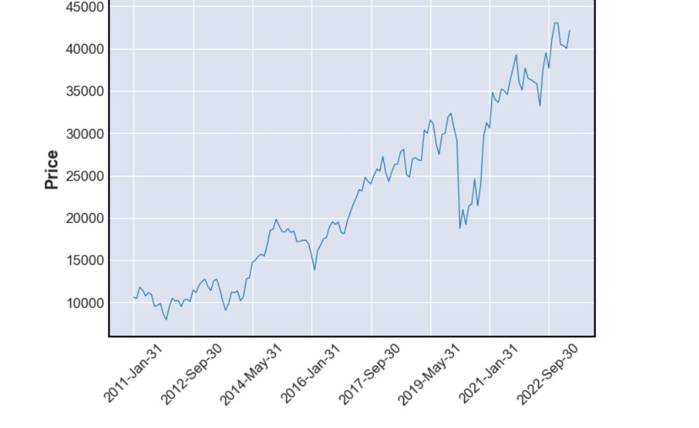
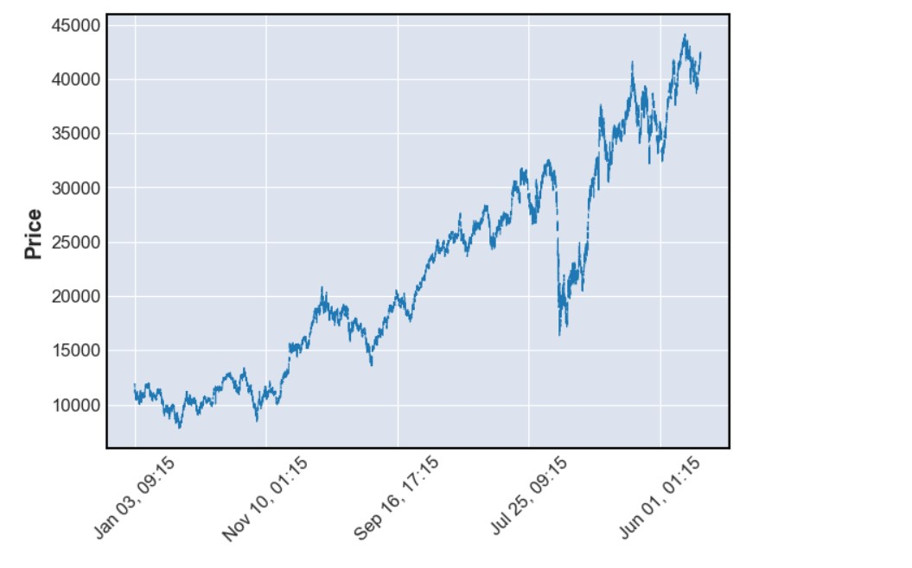

# AlgoTrading
Nifty Bank Data Analysis and Supertrend Indicator Backtesting: Exploring Trend Patterns and Performance Across Multiple Time Frames

This project focuses on analyzing Nifty Bank data spanning from 2007 to May 2023. The data is resampled into various
time frames, such as 5 minutes, 15 minutes, 1 hour, 1 week, and 1 month, in order to observe trends and patterns at different 
levels of detail.The Supertrend indicator, a popular technical analysis tool combining volatility and moving averages, is then
applied to the resampled data to generate potential buy or short signals based on trend direction.Backtesting is performed on the
different time frame data, comparing it with the Supertrend signals. Backtesting involves simulating trades using historical data 
to evaluate the performance and accuracy of a trading strategy. The results of the backtesting process provide insights 
into the effectiveness of the Supertrend indicator across different time frames. These findings will inform future trading strategies.
However, it is important to acknowledge that past performance does not guarantee future results, and the success of a trading strategy 
can be influenced by market conditions and other factors. Consequently, thorough research and analysis will continue to be conducted before 
making any investment decisions
#
#
#
